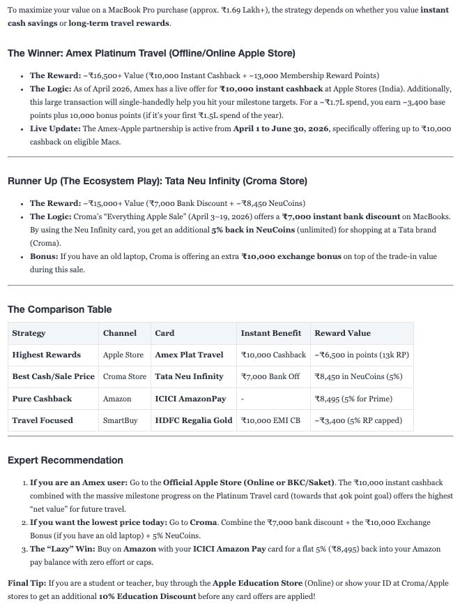
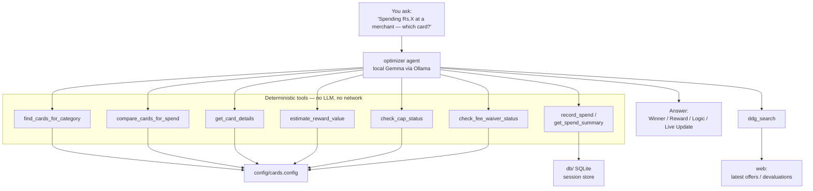

<div align="center">

# Secure Credit Card Rewards Optimiser

**Ask _"I'm spending ₹X at [merchant] — which card?"_ and get the card that
minimises your net spend — answered entirely on your own machine.**

A privacy-first rewards strategist for **your** card portfolio, powered by a
local **Gemma** model via **Ollama**. No cloud LLM. No mailbox access. No paywall.

[](https://www.python.org/)
[](https://ai.google.dev/gemma)
[](https://ollama.com)
[](https://google.github.io/adk-docs/)
[](#security-model)
[](LICENSE)

</div>

---

If you hold a dozen credit cards, every purchase is a tiny optimisation problem:
milestone math, category caps, UPI routing quirks, partner devaluations. Expense
apps either bury that under dashboards, hide it behind a paywall, or want full
mailbox access. This tool does exactly one thing — **given a transaction, name the
best card** — and does it offline, so your spending data never leaves your laptop.

<div align="center">
  
  <br>
  <em>Sample run: the optimiser working through a "which card for a MacBook Pro?" decision.</em>
</div>

## Table of contents

- [Why this exists](#why-this-exists)
- [Highlights](#highlights)
- [How it works](#how-it-works)
- [Built on Google's AI stack](#built-on-googles-ai-stack)
- [Security model](#security-model)
- [Quickstart](#quickstart)
- [Usage](#usage)
- [Configure it for your own cards](#configure-it-for-your-own-cards)
- [Onboard your cards by chatting (natural language)](#onboard-your-cards-by-chatting-natural-language)
- [Model (Gemma via Ollama)](#model-gemma-via-ollama)
- [Tools reference](#tools-reference)
- [Project structure](#project-structure)
- [Testing](#testing)
- [Linting & formatting](#linting--formatting)
- [Roadmap](#roadmap)
- [Contributing](#contributing)
- [License](#license)

## Why this exists

People who hold many credit cards face a small but constant optimisation problem
at the point of every purchase: **which card minimises the net cost of this
transaction right now?** The answer depends on a tangle of variables — per-category
reward rates, monthly cashback caps, UPI routing quirks, annual-fee waiver
thresholds, milestone math, partner-brand lists, and frequent, unannounced
devaluations.

Existing tools don't serve this moment well:

- **Expense-tracker apps** optimise for dashboards, budgeting and bill reminders;
  the "which card should I swipe?" question gets buried.
- The good ones sit **behind a paywall**, or require **full email / SMS access** to
  parse statements — a serious privacy trade-off for financial data.
- A custom LLM "assistant" solves the reasoning, but sending every transaction
  (merchant, amount, your exact card portfolio) to a **cloud LLM** re-introduces
  the same privacy problem.

**Our solution** is a local, privacy-first credit-card rewards optimiser. You ask,
in plain language, _"I'm spending ₹X at [merchant] — which card?"_ and it returns a
clear recommendation — the winning card, the approximate reward, the reasoning, and
any live offer/devaluation — computed **entirely on your own machine**. It also
tracks cap usage, fee-waiver progress and milestones across sessions, ranks the
top-N cards for a spend, and onboards your portfolio through a natural-language
interview that researches each card's current terms for you. Card knowledge is pure
configuration, so anyone can adapt it to their own cards without writing code.

Key properties:

1. **Private by construction** — transaction reasoning runs on a local model; your
   amounts and card mix never reach a cloud LLM. The only outbound traffic is a
   focused web search built from merchant + card names (never your raw sentence or
   amount).
2. **Reliable on small models** — all routing and arithmetic happen in deterministic
   Python tools, so even a compact local model gives consistent, trustworthy
   answers.
3. **Bring-your-own-cards** — the entire knowledge base (reward rates, caps, routing
   rules, fee waivers) lives in a single JSON config.

## Highlights

- **100% local reasoning** — a Gemma model runs on your machine via Ollama; your
  amounts, merchants and card mix are never sent to a cloud LLM.
- **Config-driven, bring-your-own-cards** — describe your portfolio once in
  [`config/cards.config`](config/cards.config). Reward rates, category caps, UPI
  bands and routing rules are all data, not code.
- **Natural-language onboarding** — `./scripts/setup_cards.sh` interviews you,
  researches each card's current terms on the web, and writes the config for you.
- **Reliable on small models** — routing and arithmetic happen in deterministic
  Python tools, so even a 2B-class local model gives consistent answers.
- **Cap, milestone & fee-waiver aware** — tracks shared monthly cashback caps,
  monthly spend thresholds, annual milestones, and annual fee-waiver progress
  across sessions (local SQLite).
- **Top-N comparison** — ask for the best few cards for a spend, not just one.
- **Live offer check** — a focused web search surfaces the latest offers and
  devaluations, with the query built around _merchant + card names only_.
- **Zero custom UI** — the interface is the stock **Google ADK Web UI**.

## How it works

The agent orchestrates a set of deterministic tools and formats a four-field
answer. All card knowledge is read from config; only the offer-check tool touches
the network.



**Request flow:** parse the transaction → route it through the decision matrix →
check any relevant cap/threshold → run a focused live-offer search → reply with
**Winner / Reward / Logic / Live Update**.

## Built on Google's AI stack

The solution is built end-to-end on Google's AI stack.

### 1. Gemma (Google's open model family) — the local reasoning engine
The agent's language model is **Gemma**, run locally via Ollama (default `gemma4`
family, which supports tool calling). Gemma performs the natural-language
understanding (parsing the transaction), tool orchestration, the offer-search query
authoring, and the final explanation — all on-device. Running an open Google model
locally is precisely what makes the "secure / offline" guarantee possible:
high-quality reasoning without sending data to any hosted service.

### 2. Google Agent Development Kit (ADK) — the agent framework
The whole application is an ADK agent:

- **Agent + function tools** — the optimiser is an ADK `Agent` wired to plain,
  type-hinted Python functions. ADK turns each function's signature and docstring
  into a tool schema automatically, which is how the small model reliably calls
  `find_cards_for_category`, `compare_cards_for_spend`, `check_cap_status`,
  `check_fee_waiver_status`, `estimate_reward_value`, and the web search.
- **Session state** — the spend/cap/fee-waiver tracker reads and writes
  `ToolContext.state`, which ADK persists (SQLite) across turns and restarts.
- **ADK Web UI** — the entire user interface is the stock ADK Web UI; there is no
  custom frontend to build or trust. ADK's `InMemoryRunner` also powers the
  natural-language onboarding CLI.
- **Provider abstraction** — ADK's model layer lets the same agent run on Gemma via
  Ollama or on Gemini with a one-line config change.

### 3. Gemini + Google Search grounding — optional cloud path
For users who don't need the offline guarantee, the same agent runs on **Gemini**
(`gemini-2.5-flash`) by switching one config value, and in that mode the live
offer/devaluation check uses **Google Search grounding** instead of the local
DuckDuckGo tool — wired as an ADK `AgentTool` sub-agent (ADK's built-in
`google_search` can't be combined with custom function tools in one agent). This
demonstrates the portability ADK provides across Google's local (Gemma) and hosted
(Gemini) models.

**TL;DR:** a Gemma model (via Ollama) orchestrates a set of deterministic tools,
exposed and run through Google ADK and its Web UI, with all card knowledge as
config — delivering cloud-quality rewards advice with on-device privacy.

## Security model

| Concern | How it's handled |
|---------|------------------|
| Where the LLM runs | Locally, via Ollama. No transaction data reaches a cloud model. |
| What leaves the machine | Only the offer-check query — built around _merchant + card names_ (e.g. `"Croma Tata Neu Infinity latest offer June 2026"`), never your raw sentence or amount. |
| Where your spends are stored | A local SQLite DB under `db/` (created at runtime, git-ignored). |
| Secrets | None required for the default (Ollama) setup. |

> Want a fully air-gapped run? The web-search tool degrades gracefully — if the
> machine is offline the agent simply reports "no live data" in the Live Update
> field and answers from your config.

## Quickstart

**Prerequisites:** Python 3.9+ and [Ollama](https://ollama.com).

```bash
git clone https://github.com/indranildchandra/secure-credit-card-rewards-optimiser.git
cd secure-credit-card-rewards-optimiser

# 1. Install — creates .adk_env, installs deps, pulls the Gemma model
./setup_venv.sh

# 2. Add your cards — chat to the agent; it researches each card and writes the
#    config for you (skip if you'd rather hand-edit config/cards.config)
./scripts/setup_cards.sh

# 3. Run — boots Ollama + the ADK Web UI
./run.sh
```

Open <http://localhost:8080>, select the **`optimizer`** agent, and ask away.
`./run.sh --clean` wipes the local session DB (resets tracked spends/caps).

> **New here?** Step 2 is the fastest way to get going — see
> [Onboard your cards by chatting](#onboard-your-cards-by-chatting-natural-language).
> The shipped `config/cards.config` is only an example portfolio.

**Two setup scripts, one job split in two:**

- **`setup_venv.sh`** — the full first-time setup you run by hand. It calls
  `scripts/setup-env.sh` and then additionally **pulls the Ollama model**.
- **`scripts/setup-env.sh`** — the shared, idempotent bootstrap (virtualenv +
  Python deps only, no model pull). Every AI-tool session hook
  (`.claude/`, `.gemini/`, `.cursor/`) calls this, so the environment is
  identical everywhere. You rarely run it directly.

## Usage

> **You:** I am spending ₹1,50,000 on a MacBook Pro at an Apple Store. Which card?

```text
The Winner:      Amex Platinum Travel
The Reward:      ~2% value + milestone progress
The Logic:       Large non-category spend — routes to Amex to push toward the
                 ₹7 Lakh annual milestone (22,500 bonus RP + ₹10,000 Taj voucher).
                 You're ₹5,50,000 away this year.
The Live Update: No notable changes found for Apple Store + Amex this month.
```

_(Illustrative — exact wording depends on your config, tracked spends, and live
search results.)_

You can also ask for a comparison or a fee-waiver check, e.g.:

> **You:** Show me the top 3 cards for ₹4,000 at Amazon.
>
> **You:** Am I close to waiving my HDFC Regalia Gold annual fee?

See [`tests/TEST-CASES.md`](tests/TEST-CASES.md) for ~30 worked prompts covering
core routing, UPI amount bands, nuance checks, and cap-aware flows.

## Configure it for your own cards

This is a **generic** optimiser — bring your portfolio by editing
[`config/cards.config`](config/cards.config) (JSON). No Python changes. The
shipped config is just an example set of cards.

Each card entry:

```jsonc
"My Card Name": {
  "rewards": ["human-readable reward lines, shown in answers"],
  "fees": "…", "milestones": "…",        // optional, human-readable
  "value_back": {                         // machine-readable reward rate
    "top_rate": 5.0,                      // % back in the bonus category
    "top_keywords": ["amazon"],           // categories that earn top_rate
    "base_rate": 1.0                      // % back on everything else
  },
  "tracker": {                            // OPTIONAL — enables cap/threshold tracking
    "type": "combined_monthly_cashback",
    "categories": ["dining", "grocery"],
    "rate": 0.10,
    "cap_value": 1000,
    "label": "combined monthly cashback"
  }
}
```

**Routing** lives under `decision_matrix` — ordered rules mapping merchant/
category `keywords` (with optional `min_amount` / `max_amount` bands) to a
`primary` card, a `strategy`, and an optional `fallback`.

**Tracker types** — declare a `tracker` block on any card to enable tracking:

| `type` | Fields | Tracks |
|--------|--------|--------|
| `combined_monthly_cashback` | `categories`, `rate`, `cap_value` | A cashback cap shared across categories within a month. |
| `monthly_spend_threshold` | `threshold`, `counts_cards` _(optional)_ | A monthly spend target (optionally summing several cards). |
| `annual_spend_milestone` | `target` | Year-to-date spend toward an annual milestone. |

You can also tune the agent's behaviour in
[`config/system_instruction.prompt`](config/system_instruction.prompt) — no code
required.

## Onboard your cards by chatting (natural language)

Don't want to hand-write JSON? Let an agent do the research and write the config
for you:

```bash
./scripts/setup_cards.sh                                # interactive (requires Ollama)
./scripts/setup_cards.sh --once "I have an SBI Cashback card"   # one-shot / scriptable
```

The wrapper activates the project virtualenv and runs `scripts/setup_cards.py`
(`python scripts/setup_cards.py` works too if your env is already active). It
reverse-prompts you for the cards you hold, does detailed web research on each
card's current terms (reward rates, caps, milestones, fees and fee-waiver spend,
UPI/forex nuances, recent devaluations), shows you the proposed entry for
confirmation, and — once you approve — writes it into `config/cards.config` and
adds the matching routing rules. Its system prompt lives in
[`config/setup_cards_instruction.prompt`](config/setup_cards_instruction.prompt).
Restart `./run.sh` afterwards to load the changes.

The `--once "TEXT"` flag sends a single message and exits (no interactive TTY) —
handy for scripting or quick checks. If the model can't be reached it fails with
a clear message and a non-zero exit code.

## Model (Gemma via Ollama)

This project targets Google's **Gemma** family running locally on Ollama. The
optimiser **requires tool calling**, which the **Gemma 4** generation supports on
Ollama (earlier Gemma generations do not, so they won't work). Set your tag in
[`config/model.config`](config/model.config):

```ini
MODEL_PROVIDER=ollama
MODEL_NAME=gemma4:e2b
OLLAMA_API_BASE=http://localhost:11434
```

| Model tag | Approx size | Notes |
|-----------|-------------|-------|
| `gemma4:e2b` | ~7.2 GB | Efficient; good for 16 GB RAM machines (**default**). |
| `gemma4:e4b` | ~9.6 GB | Higher quality; needs 16 GB+ RAM. |
| `gemma4`     | —       | Alias for the current Gemma 4 default tag. |
| `gemma4:27b` | ~17 GB  | Best quality; needs a large-VRAM GPU. |

### Optional cloud path: Gemini

To run the same agent on **Gemini** instead (see
[Built on Google's AI stack](#built-on-googles-ai-stack)), switch the provider in
`config/model.config` and add credentials — no code changes:

```ini
MODEL_PROVIDER=gemini
MODEL_NAME=gemini-2.5-flash
```

Then `cp .env.example .env` and set `GOOGLE_API_KEY` (or Vertex AI vars). In this
mode the live offer check uses **Google Search grounding** instead of DuckDuckGo.
Note this is **not offline** — transaction data leaves your machine — so it trades
away the privacy guarantee.

## Tools reference

All tools are plain Python functions exposed to the agent via ADK.

### [`tools/card_tools.py`](tools/card_tools.py) — deterministic routing & lookup
| Method | Signature | What it does |
|--------|-----------|--------------|
| `find_cards_for_category` | `(merchant_or_category: str, amount: float = 0.0) -> dict` | Matches merchant/category text (and amount band) against the decision matrix; returns ranked `{primary, strategy, fallback}`. |
| `compare_cards_for_spend` | `(merchant_or_category: str, amount: float, top_n: int = 3) -> dict` | Ranks the whole portfolio by value for a spend; returns the top N (with the decision-matrix primary flagged). |
| `get_card_details` | `(card_name: str) -> dict` | Full reference for one card (fuzzy/alias name match). |
| `list_all_cards` | `() -> list` | Every card with a one-line "when to use". |
| `estimate_reward_value` | `(card_name: str, amount: float, category: str = "") -> dict` | Approximate ₹/% value-back, read from each card's `value_back` config. |

### [`tools/spend_tracker.py`](tools/spend_tracker.py) — session-state caps & thresholds
| Method | Signature | What it does |
|--------|-----------|--------------|
| `record_spend` | `(tool_context, category: str, amount: float, card: str = "") -> str` | Records a spend for the current month (by category and card). |
| `get_spend_summary` | `(tool_context) -> dict` | This month's totals by category and card. |
| `get_spend_history` | `(tool_context, months_back: int = 3) -> dict` | Recalls recent months' totals from the persistent user-scoped log ("what did I spend on dining last month?"). |
| `check_cap_status` | `(tool_context, card_name: str) -> dict` | Remaining headroom for the card's configured `tracker` (cap / threshold / milestone). |
| `check_fee_waiver_status` | `(tool_context, card_name: str) -> dict` | Year-to-date spend vs the card's annual fee-waiver threshold (or lifetime-free). |

### [`tools/duckduckgo_search.py`](tools/duckduckgo_search.py) — live web search
| Method | Signature | What it does |
|--------|-----------|--------------|
| `ddg_search` | `(query: str) -> str` | Free DuckDuckGo search for the latest offers/devaluations. No API key; the model authors a focused _merchant + card_ query. |

### [`tools/config_writer.py`](tools/config_writer.py) — used by `scripts/setup_cards.py` onboarding
| Method | Signature | What it does |
|--------|-----------|--------------|
| `list_configured_cards` | `() -> dict` | Names of cards already in `config/cards.config`. |
| `save_card` | `(card_json: str) -> str` | Validates and writes one card entry into the config (atomic). |
| `add_decision_rule` | `(rule_json: str) -> str` | Validates and adds/replaces a routing rule in the decision matrix. |
| `remove_card` | `(card_name: str) -> str` | Removes a card and any routing rules that pointed at it. |

## Project structure

```
config/
  model.config               provider/model selection (Gemma via Ollama)
  cards.config               your card knowledge base (Full Reference + Decision Matrix)
  system_instruction.prompt  the optimiser agent's system prompt
  setup_cards_instruction.prompt  the onboarding agent's system prompt
optimizer/
  agent.py                   ADK root_agent — orchestrates tools, formats the answer
  context_window.py          opt-in sliding-window history compaction for long sessions
data/
  cards.py                   loads config/cards.config and derives lookup helpers
tools/
  card_tools.py              deterministic routing / lookup / reward / compare tools
  spend_tracker.py           session-state cap, threshold & fee-waiver tracker
  duckduckgo_search.py       live offers/devaluation web search
  config_writer.py           validates + writes cards.config (used by onboarding)
config.py                    reads config/model.config -> MODEL (Ollama/Gemini)
.env.example                 template for credentials (only needed for the Gemini path)
run.sh                       boots Ollama + `adk web .` on :8080, persistent sessions
setup_venv.sh                full first-time setup: runs scripts/setup-env.sh + pulls the model
scripts/
  setup-env.sh               shared env bootstrap (venv + deps); used by every tool hook
  setup_cards.py             natural-language card onboarding agent (CLI)
  setup_cards.sh             shell wrapper that activates the venv and runs the CLI
db/                          local SQLite session store (created at runtime, git-ignored)
tests/                       offline pytest suite + manual TEST-CASES.md
AGENTS.md                    contributor guide for AI coding tools (single source of truth)
CLAUDE.md / GEMINI.md       thin pointers that import AGENTS.md
CONTRIBUTING.md             how to contribute
.claude/ .gemini/ .cursor/  per-tool session hooks (all call scripts/setup-env.sh)
```

## Testing

The deterministic core is covered by a fast, fully-offline pytest suite (no LLM,
no network):

```bash
source .adk_env/bin/activate
python -m pytest tests/ -q
```

It validates decision-matrix routing, reward estimates, and cap/threshold math —
including a test that registers a brand-new card purely via config data to prove
the engine is config-driven. End-to-end prompts live in
[`tests/TEST-CASES.md`](tests/TEST-CASES.md).

## Linting & formatting

[ruff](https://docs.astral.sh/ruff/) (linter) and
[black](https://black.readthedocs.io/) (formatter) are installed with the
dependencies; config is in [`pyproject.toml`](pyproject.toml).

```bash
source .adk_env/bin/activate
ruff check .       # lint
black .            # format  (black --check . to verify only)
```

## Roadmap

- [x] Multi-card comparison ("show me the top 3 for this spend").
- [x] Per-card fee-waiver progress tracking.
- [x] Natural-language import / removal of cards in `cards.config`.
- [x] Config validation (fail-fast) and CI (ruff + black + pytest).
- [x] Eligibility-aware value model (min-txn / excluded-category / cap-exhaustion).
- [ ] True net-cost (price − reward − fees + forex) per card.
- [ ] Local CSV/statement import to populate the spend log (no mailbox access).
- [ ] Automated agent-level (end-to-end) evals against an offline judge model.

## Contributing

Contributions are welcome. See **[CONTRIBUTING.md](CONTRIBUTING.md)** for setup,
workflow, and code-style details, and **[AGENTS.md](AGENTS.md)** if you're using
an AI coding tool. In short: prefer editing `config/cards.config` over adding
code, and run `ruff check .`, `black .`, and `python -m pytest tests/ -q` before
opening a PR.

## License

[MIT](LICENSE) © 2026 Indranil Chandra.
