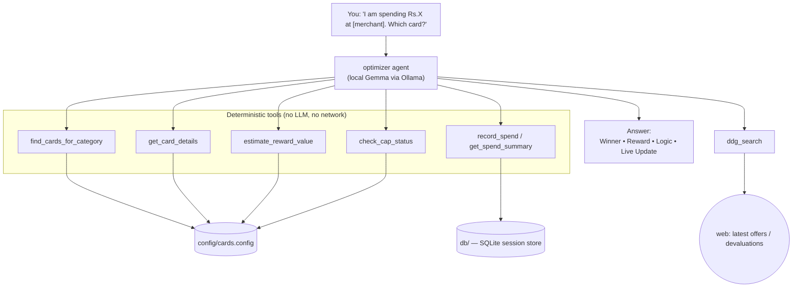

<div align="center">

# Secure Credit Card Rewards Optimiser

**Ask _"I'm spending ₹X at [merchant] — which card?"_ and get the card that
minimises your net spend — answered entirely on your own machine.**

A privacy-first rewards strategist for **your** card portfolio, powered by a
local **Gemma** model via **Ollama**. No cloud LLM. No mailbox access. No paywall.

[](https://www.python.org/)
[](https://ai.google.dev/gemma)
[](https://ollama.com)
[](https://google.github.io/adk-docs/)
[](#security-model)
[](LICENSE)

</div>

---

If you hold a dozen credit cards, every purchase is a tiny optimisation problem:
milestone math, category caps, UPI routing quirks, partner devaluations. Expense
apps either bury that under dashboards, hide it behind a paywall, or want full
mailbox access. This tool does exactly one thing — **given a transaction, name the
best card** — and does it offline, so your spending data never leaves your laptop.

## Table of contents

- [Highlights](#highlights)
- [How it works](#how-it-works)
- [Security model](#security-model)
- [Quickstart](#quickstart)
- [Usage](#usage)
- [Configure it for your own cards](#configure-it-for-your-own-cards)
- [Model (Gemma via Ollama)](#model-gemma-via-ollama)
- [Tools reference](#tools-reference)
- [Project structure](#project-structure)
- [Testing](#testing)
- [Linting & formatting](#linting--formatting)
- [Roadmap](#roadmap)
- [Contributing](#contributing)
- [License](#license)

## Highlights

- **100% local reasoning** — a Gemma model runs on your machine via Ollama; your
  amounts, merchants and card mix are never sent to a cloud LLM.
- **Config-driven, bring-your-own-cards** — describe your portfolio once in
  [`config/cards.config`](config/cards.config). Reward rates, category caps, UPI
  bands and routing rules are all data, not code.
- **Reliable on small models** — routing and arithmetic happen in deterministic
  Python tools, so even a 2B-class local model gives consistent answers.
- **Cap & milestone aware** — tracks shared monthly cashback caps, monthly spend
  thresholds, and annual milestones across sessions (local SQLite).
- **Live offer check** — a focused web search surfaces the latest offers and
  devaluations, with the query built around _merchant + card names only_.
- **Zero custom UI** — the interface is the stock **Google ADK Web UI**.

## How it works

The agent orchestrates a set of deterministic tools and formats a four-field
answer. All card knowledge is read from config; only the offer-check tool touches
the network.



**Request flow:** parse the transaction → route it through the decision matrix →
check any relevant cap/threshold → run a focused live-offer search → reply with
**Winner / Reward / Logic / Live Update**.

## Security model

| Concern | How it's handled |
|---------|------------------|
| Where the LLM runs | Locally, via Ollama. No transaction data reaches a cloud model. |
| What leaves the machine | Only the offer-check query — built around _merchant + card names_ (e.g. `"Croma Tata Neu Infinity latest offer June 2026"`), never your raw sentence or amount. |
| Where your spends are stored | A local SQLite DB under [`db/`](db/), which is git-ignored. |
| Secrets | None required for the default (Ollama) setup. |

> Want a fully air-gapped run? The web-search tool degrades gracefully — if the
> machine is offline the agent simply reports "no live data" in the Live Update
> field and answers from your config.

## Quickstart

**Prerequisites:** Python 3.9+ and [Ollama](https://ollama.com).

```bash
git clone https://github.com/indranildchandra/secure-credit-card-rewards-optimiser.git
cd secure-credit-card-rewards-optimiser

chmod +x setup_venv.sh run.sh
./setup_venv.sh     # creates .adk_env, installs deps, pulls the Gemma model
./run.sh            # boots Ollama + the ADK Web UI
```

Open <http://localhost:8080>, select the **`optimizer`** agent, and ask away.
`./run.sh --clean` wipes the local session DB (resets tracked spends/caps).

## Usage

> **You:** I am spending ₹1,50,000 on a MacBook Pro at an Apple Store. Which card?

```text
The Winner:      Amex Platinum Travel
The Reward:      ~2% value + milestone progress
The Logic:       Large non-category spend — routes to Amex to push toward the
                 ₹7 Lakh annual milestone (22,500 bonus RP + ₹10,000 Taj voucher).
                 You're ₹5,50,000 away this year.
The Live Update: No notable changes found for Apple Store + Amex this month.
```

_(Illustrative — exact wording depends on your config, tracked spends, and live
search results.)_

See [`tests/TEST-CASES.md`](tests/TEST-CASES.md) for ~30 worked prompts covering
core routing, UPI amount bands, nuance checks, and cap-aware flows.

## Configure it for your own cards

This is a **generic** optimiser — bring your portfolio by editing
[`config/cards.config`](config/cards.config) (JSON). No Python changes. The
shipped config is just an example set of cards.

Each card entry:

```jsonc
"My Card Name": {
  "rewards": ["human-readable reward lines, shown in answers"],
  "fees": "…", "milestones": "…",        // optional, human-readable
  "value_back": {                         // machine-readable reward rate
    "top_rate": 5.0,                      // % back in the bonus category
    "top_keywords": ["amazon"],           // categories that earn top_rate
    "base_rate": 1.0                      // % back on everything else
  },
  "tracker": {                            // OPTIONAL — enables cap/threshold tracking
    "type": "combined_monthly_cashback",
    "categories": ["dining", "grocery"],
    "rate": 0.10,
    "cap_value": 1000,
    "label": "combined monthly cashback"
  }
}
```

**Routing** lives under `decision_matrix` — ordered rules mapping merchant/
category `keywords` (with optional `min_amount` / `max_amount` bands) to a
`primary` card, a `strategy`, and an optional `fallback`.

**Tracker types** — declare a `tracker` block on any card to enable tracking:

| `type` | Fields | Tracks |
|--------|--------|--------|
| `combined_monthly_cashback` | `categories`, `rate`, `cap_value` | A cashback cap shared across categories within a month. |
| `monthly_spend_threshold` | `threshold`, `counts_cards` _(optional)_ | A monthly spend target (optionally summing several cards). |
| `annual_spend_milestone` | `target` | Year-to-date spend toward an annual milestone. |

You can also tune the agent's behaviour in
[`config/system_instruction.prompt`](config/system_instruction.prompt) — no code
required.

## Model (Gemma via Ollama)

This project targets Google's **Gemma** family running locally on Ollama. The
optimiser **requires tool calling**, which the **Gemma 4** generation supports on
Ollama (earlier Gemma generations do not, so they won't work). Set your tag in
[`config/model.config`](config/model.config):

```ini
MODEL_PROVIDER=ollama
MODEL_NAME=gemma4:e2b
OLLAMA_API_BASE=http://localhost:11434
```

| Model tag | Approx size | Notes |
|-----------|-------------|-------|
| `gemma4:e2b` | ~7.2 GB | Efficient; good for 16 GB RAM machines (**default**). |
| `gemma4:e4b` | ~9.6 GB | Higher quality; needs 16 GB+ RAM. |
| `gemma4`     | —       | Alias for the current Gemma 4 default tag. |
| `gemma4:27b` | ~17 GB  | Best quality; needs a large-VRAM GPU. |

## Tools reference

All tools are plain Python functions exposed to the agent via ADK.

### [`tools/card_tools.py`](tools/card_tools.py) — deterministic routing & lookup
| Method | Signature | What it does |
|--------|-----------|--------------|
| `find_cards_for_category` | `(merchant_or_category: str, amount: float = 0.0) -> dict` | Matches merchant/category text (and amount band) against the decision matrix; returns ranked `{primary, strategy, fallback}`. |
| `get_card_details` | `(card_name: str) -> dict` | Full reference for one card (fuzzy/alias name match). |
| `list_all_cards` | `() -> list` | Every card with a one-line "when to use". |
| `estimate_reward_value` | `(card_name: str, amount: float, category: str = "") -> dict` | Approximate ₹/% value-back, read from each card's `value_back` config. |

### [`tools/spend_tracker.py`](tools/spend_tracker.py) — session-state caps & thresholds
| Method | Signature | What it does |
|--------|-----------|--------------|
| `record_spend` | `(tool_context, category: str, amount: float, card: str = "") -> str` | Records a spend for the current month (by category and card). |
| `get_spend_summary` | `(tool_context) -> dict` | This month's totals by category and card. |
| `check_cap_status` | `(tool_context, card_name: str) -> dict` | Remaining headroom for the card's configured `tracker` (cap / threshold / milestone). |

### [`tools/duckduckgo_search.py`](tools/duckduckgo_search.py) — live web search
| Method | Signature | What it does |
|--------|-----------|--------------|
| `ddg_search` | `(query: str) -> str` | Free DuckDuckGo search for the latest offers/devaluations. No API key; the model authors a focused _merchant + card_ query. |

## Project structure

```
config/
  model.config              provider/model selection (Gemma via Ollama)
  cards.config              your card knowledge base (Full Reference + Decision Matrix)
  system_instruction.prompt the agent's system prompt
optimizer/
  agent.py                  ADK root_agent — orchestrates tools, formats the answer
data/
  cards.py                  loads config/cards.config and derives lookup helpers
tools/
  card_tools.py             deterministic routing / lookup / reward-estimate tools
  spend_tracker.py          session-state cap & threshold tracker
  duckduckgo_search.py      live offers/devaluation web search
config.py                   reads config/model.config -> MODEL (Ollama/Gemini)
run.sh                      boots Ollama + `adk web .` on :8080, persistent sessions
setup_venv.sh               full first-time setup (env + deps + pulls the model)
scripts/setup-env.sh        shared env bootstrap used by every tool's session hook
db/                         local SQLite session store (git-ignored)
tests/                      offline pytest suite + manual TEST-CASES.md
AGENTS.md                   contributor guide for AI coding tools (single source of truth)
CLAUDE.md / GEMINI.md       thin pointers that import AGENTS.md
CONTRIBUTING.md             how to contribute
.claude/ .gemini/ .agents/  per-tool SessionStart hooks (all call scripts/setup-env.sh)
```

## Testing

The deterministic core is covered by a fast, fully-offline pytest suite (no LLM,
no network):

```bash
source .adk_env/bin/activate
python -m pytest tests/ -q
```

It validates decision-matrix routing, reward estimates, and cap/threshold math —
including a test that registers a brand-new card purely via config data to prove
the engine is config-driven. End-to-end prompts live in
[`tests/TEST-CASES.md`](tests/TEST-CASES.md).

## Linting & formatting

[ruff](https://docs.astral.sh/ruff/) (linter) and
[black](https://black.readthedocs.io/) (formatter) are installed with the
dependencies; config is in [`pyproject.toml`](pyproject.toml).

```bash
source .adk_env/bin/activate
ruff check .       # lint
black .            # format  (black --check . to verify only)
```

## Roadmap

- [ ] Multi-card comparison ("show me the top 3 for this spend").
- [ ] Per-card fee-waiver progress tracking.
- [ ] Optional natural-language import of a card's terms into `cards.config`.

## Contributing

Contributions are welcome. See **[CONTRIBUTING.md](CONTRIBUTING.md)** for setup,
workflow, and code-style details, and **[AGENTS.md](AGENTS.md)** if you're using
an AI coding tool. In short: prefer editing `config/cards.config` over adding
code, and run `ruff check .`, `black .`, and `python -m pytest tests/ -q` before
opening a PR.

## License

[MIT](LICENSE) © 2026 Indranil Chandra.
